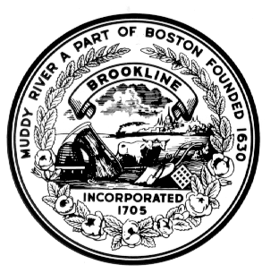

## ARTICLE 1.2 TOWN SEAL

The Town shall have a seal which shall be in the following style:

The Town Clerk shall be the keeper of the Town seal. Papers and
documents issued from any Town agency may be attested by use of the Town
seal.
